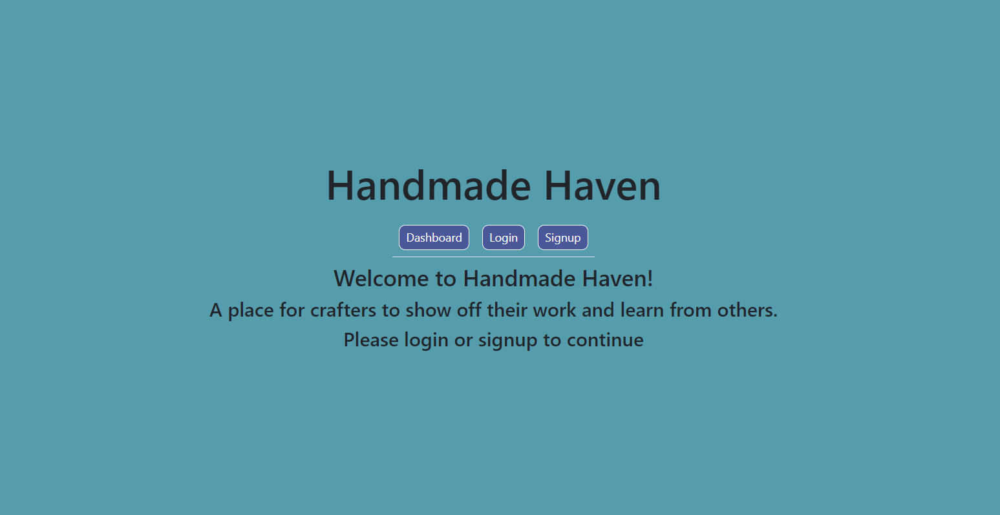
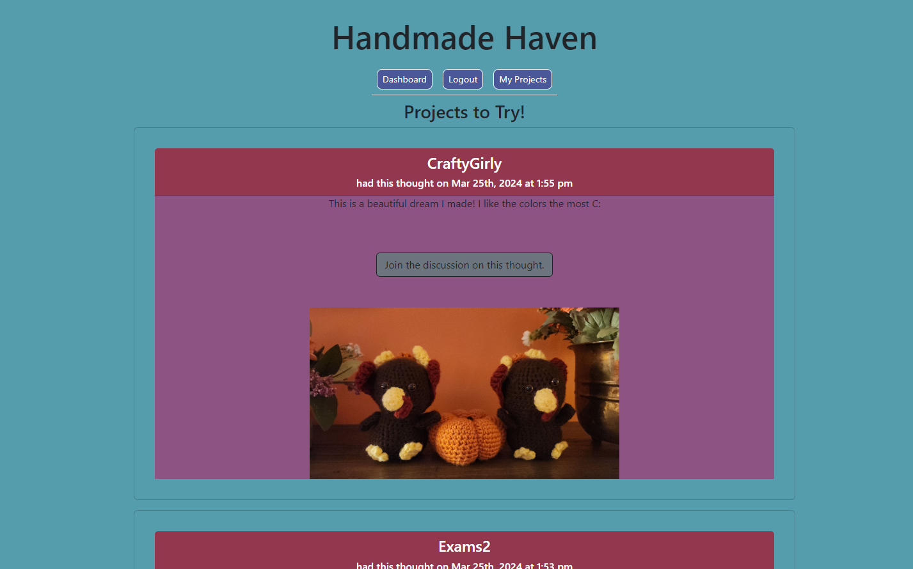
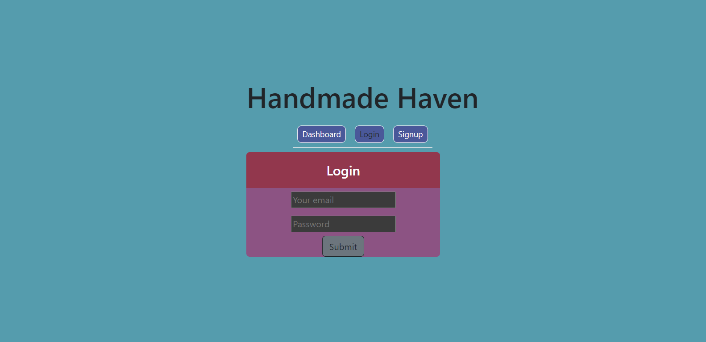
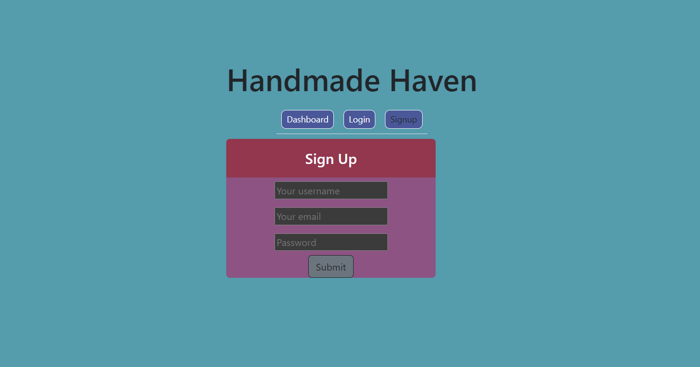
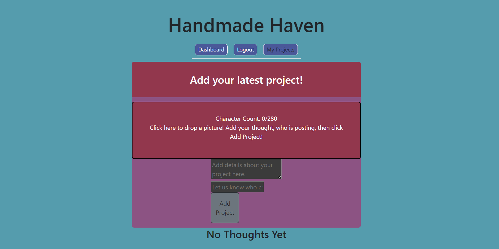

# Handmade Haven
This is a magical place for crafters alike to gather together to share their craft projects and sometimes get help on a project their stuck on.

### Table of Contents
- [Description](#description)
- [Screenshots](#screenshots)
- [Live Site](#live-site)
- [Technologies Used](#technologies-used)
- [Installation](#installation)
- [Features](#features)
- [Contribution Guidelines](#contribution-guidelines)
- [License](#license)
- [Questions](#questions)

# Description
This project is a full-stack web application built using the MERN stack (MongoDB, Express.js, React.js, Node.js). It allows users to share their thoughts and projects with others by creating posts. Users can sign up, log in, create, edit, and delete posts, as well as add comments to existing posts. The application utilizes GraphQL for efficient data fetching and mutation operations, providing a seamless user experience. Additionally, it incorporates file upload functionality for users to attach images to their posts, enhancing the visual aspect of their content.

# Screenshots
### Homepage

### Dashboard

### Log In

### Sign Up

### Projects Page

# Live Site
We know you are so excited to get into the crafting mood, [here](https://handmade-haven-nn6b.onrender.com/) is where you can check out our live site!

# Technology Used
This project utilizes a MERN stack architecture, comprising MongoDB as the database, Express.js for the server-side framework, React.js for the frontend user interface, and Node.js for backend development. GraphQL is employed as the query language and runtime for efficiently fetching and manipulating data, offering a more flexible and optimized approach compared to traditional REST APIs. Multer middleware facilitates file uploads, allowing users to attach images to their posts. Authentication and authorization functionalities are implemented using JWT (JSON Web Tokens) for secure user authentication and authorization processes. Overall, the project leverages modern web development technologies to create a robust and feature-rich application.

# Installation
1. Clone the repo: `git clone https://github.com/PotionSela/handmade-haven`
2. Open in VS Code, if you don't have it, install it before doing anything else.
3. Using the terminal, install node.js v16
4. Once node.js is installed, in the terminal, use the command npm init -y to initialize and create a package.json
5. Next, use the terminal to run the command `npm i` to install the dependencies needed for this application:
    - npm i express
    - npm i bcrypt
    - npm i dotenv
    - npm i graphql
    - npm i jsonwebtoken
    - npm i mongoose
    - npm i multer
    - npm i react
    - npm i react-dom
    - npm i react-dropzone
    - npm i react-router-dom
    - npm i nodemon
    - npm i jwt-decode
6. Next, you will want to make sure you have access to MongoDB by having an account and have MongoDB Compass. These will allow you to interact with the database and visually confirm what changes are being made in the database.
7. Once you have installed all the dependencies, open up a new terminal in the root of the project, do the following commands: `npm run seed` this will seed your database. `npm run build` this will build your application, you will also be able to see if there are any errors in the build process. `npm run develop` this will start the application and bring it up in a new tab of your default browser. 
8. Have fun with your new feature branch!

# Features
This project features a user-friendly interface for creating and sharing thoughts or projects, with support for attaching images to posts. Users can register and log in securely, with authentication handled using JSON Web Tokens (JWT). Thoughtful functionalities include adding, updating, and deleting thoughts, as well as adding and removing comments. The application utilizes GraphQL for efficient data fetching and manipulation, providing a seamless experience for users interacting with the platform. Additionally, the project incorporates modern technologies such as React.js, Express.js, and MongoDB to ensure scalability, performance, and maintainability.

# Contribution Guidelines
This project is open to collaborations. If you choose to do so, open an issue and modify any changes you would like to see on a feature branch, and then wait for the approval before merging to the main branch.

# License
This application has no license.

# Questions
Have any additional questions, or would like to discuss this project? [Contact Gisela here.](https://github.com/PotionSela) [Contact Ida here.](https://github.com/Ida-Whit) [Contact Kiki here.](https://github.com/AngelCatLatte)